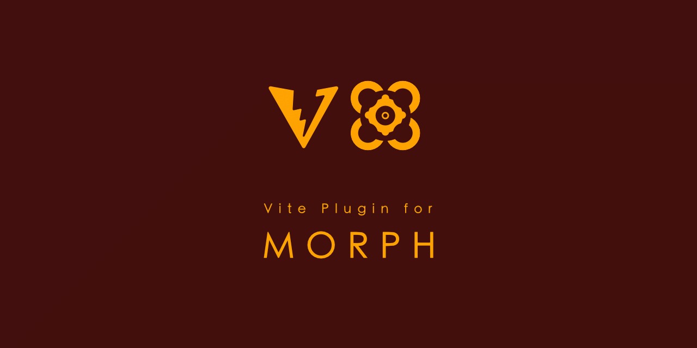

# Morph Plugin for Vite (@peter.naydenov/vite-plugin-morph)


A Vite plugin for processing `.morph` files with HTML-like syntax, CSS modules, and JavaScript helpers. Built on top of `@peter.naydenov/morph` v3.5.2.

## Features

- 🎨 **HTML-like Syntax** - Write components with familiar HTML/CSS/JS structure
- 🏗️ **CSS Layers Architecture** - Complete CSS processing with @layer cascade, tree-shaking, and bundling
- 📦 **CSS Modules** - Automatic CSS scoping with unique class names
- ⚡ **PostCSS Processing** - Autoprefixer, minification, and source maps
- 🌳 **CSS Tree-Shaking** - 30-70% bundle size reduction by removing unused CSS
- 📦 **Advanced Bundling** - CSS chunking, cache invalidation, and single optimized bundles
- 🔥 **CSS Hot Module Replacement** - Instant style updates during development
- 🐛 **Enhanced Error Reporting** - File location tracking and detailed CSS error messages
- 🔧 **CSS Debugging Tools** - Rich inspection utilities and processing logs
- 🛠️ **TypeScript Support** - Full type definitions included
- ⚡ **Vite Integration** - Seamless Vite 8.x+ plugin API integration
- 🔄 **Morph Syntax** - Full support for `@peter.naydenov/morph` template syntax and helpers
- ⚙️ **Zero Config** - Works out of the box with sensible defaults
- 🎯 **Production Optimized** - Built-in optimizations for production builds
- 📚 **Library Mode** - Build distributable component libraries with runtime CSS control

## Installation

```bash
npm install @peter.naydenov/vite-plugin-morph --save-dev
```

## Quick Start

### 1. Configure Vite

```javascript
// vite.config.js
import { defineConfig } from 'vite';
import morphPlugin from '@peter.naydenov/vite-plugin-morph';

export default defineConfig({
  plugins: [morphPlugin()],
});
```

### 2. VS Code Extension

For the best development experience with `.morph` files, install the **Morph Template Syntax Highlighter** extension:

- **Extension Name**: `PeterNaydenov.morph-template-syntax-highlighting`
- **Marketplace Link**: https://marketplace.visualstudio.com/items?itemName=PeterNaydenov.morph-template-syntax-highlighting

**Features**:

- 🎨 Full syntax highlighting for `.morph` files
- 📦 HTML-like template support
- 🎯 JavaScript helper function highlighting
- 🎭 CSS style section support
- 📋 JSON handshake data highlighting
- 🧠 Auto-completion for morph syntax
- 🚀 Error checking and validation
- 🌙 Dark/light theme support

This extension provides a **professional editing experience** with syntax highlighting, IntelliSense, and real-time error detection for your `.morph` files.

### 3. Create a Morph Component

```html
<!-- src/components/Button.morph -->
<button class="{{ : getButtonClasses }}" data-click="{{action}}">
  {{text}}
</button>

<script>
  function getButtonClasses({ data, dependencies }) {
    // Access scoped CSS class names
    const btnClass = dependencies.styles.btn || 'btn';
    const variants = {
      primary: dependencies.styles['btn-primary'] || 'btn-primary',
      secondary: dependencies.styles['btn-secondary'] || 'btn-secondary',
      danger: dependencies.styles['btn-danger'] || 'btn-danger',
    };
    const variantClass = variants[data.variant] || variants.primary;
    return `${btnClass} ${variantClass}`;
  }
</script>

<style>
  .btn {
    padding: var(--btn-padding, 0.5rem 1rem);
    border: none;
    border-radius: var(--btn-radius, 4px);
    cursor: pointer;
  }

  .btn.primary {
    background: var(--primary-color, #007bff);
    color: white;
  }
</style>

<script type="application/json">
  {
    "text": "Click me",
    "variant": "primary",
    "action": "handleClick"
  }
</script>
```

### 4. Use in Your Application

```javascript
import Button, { styles } from './components/Button.morph';

// Render with custom data
const customButton = Button({
  text: 'Save Changes',
  variant: 'primary',
  action: 'handleClick',
});

document.body.innerHTML = customButton;

// Access typed handshake data
console.log(handshake.text); // string
console.log(handshake.variant); // string

// Use typed CSS module classes
const className = styles.btn; // string
```

## CSS Layers Architecture

The plugin includes a comprehensive CSS processing system that transforms your component styles into a modern, scalable architecture.

### CSS Modules & Scoping

Component styles are automatically scoped with unique class names to prevent conflicts:

```html
<!-- Button.morph -->
<button class="{{ : getButtonClass }}">Click me</button>

<script>
  function getButtonClass({ data, dependencies }) {
    // Access scoped CSS class names
    const btnClass = dependencies.styles.btn || 'btn';
    return btnClass;
  }
</script>

<style>
  .btn {
    background: blue;
    color: white;
  }
</style>
```

Generates scoped CSS:

```css
.Button_btn_abc123 {
  background: blue;
  color: white;
}
```

> **No double hashing.** The scoper must detect a class name that's already in scoped/hashed form (e.g. re-processing `libs`-layer CSS from an already-built library) and leave it as-is, rather than hashing it again into something like `Button_Button_btn_abc123_xyz789`. This matters whenever CSS could pass through the scoping step more than once — e.g. a project that both locally develops and locally consumes a component library.

### CSS @layer Cascade Control

Organize styles with predictable precedence using five CSS layers, lowest to highest precedence (a later `@layer` always wins over an earlier one regardless of selector specificity):

```css
@layer vendors, libs, modules, app, context;
```

| Layer | Contents | Scoped? |
| --- | --- | --- |
| `vendors` | Third-party CSS you don't control (resets, external non-morph UI kit base styles). | No |
| `libs` | Published `.morph` component libraries' shipped CSS — "white-label" component descriptions. | **Yes** — CSS-modules scoped (hashed class names), generated once at the point the `.morph` file compiles (i.e. at `buildLibrary()` time for a library). |
| `modules` | Local, host-authored component CSS. | **Yes** — same scoping mechanism as `libs`, just compiled by the host's own build instead of a library's. |
| `app` | Current app/brand-level customization — colors, sizes, fonts, and theme variable (`--token`) definitions. Theme switching (see [Library Lifecycle](#library-lifecycle-two-theme-runtimes)) is a swap of the values defined at this layer, not a separate cascade layer. | No — pure, unscoped selectors. |
| `context` | Situational/contextual overrides (e.g. "this button looks different inside the sidebar"). | No — pure selectors, often with contextual combinators (`.sidebar .btn`). |

Because `libs` and `modules` are both CSS-modules scoped, they can't accidentally clobber each other — any genuine collision resolves in favor of `modules` (local/host) by layer order. Because `app`/`context` sit above both, brand and contextual overrides always win without needing extra specificity or `!important`.

**Dual class-name export** is what makes `app`/`context` able to target components at all despite `libs`/`modules` using hashed names: every component CSS-module class is exported under *two* names simultaneously — the standard hashed/scoped one, and a parallel plain "light label" with no hash, applied to the same element:

```html
<button class="Button_btn_x7k9p2 btn">Click me</button>
```

`Button_btn_x7k9p2` is what `libs`/`modules` rules use internally (collision-safe). `btn` — the light label — is not a design/styling name, it's a stable hook: `app`/`context` layer rules target it with plain selectors to customize a component for the current brand/situation without forking the component's own CSS.

```html
<!-- Theme.morph -->
<style>
  @layer libs {
    .Button_btn_x7k9p2 {
      background: var(--primary-color);
      padding: var(--btn-padding);
    }
  }

  @layer app {
    :root {
      --primary-color: #007bff;
      --btn-padding: 0.5rem 1rem;
    }
    .btn {
      border-radius: 999px; /* brand-level shape override, targets the light label */
    }
  }

  @layer context {
    .sidebar .btn {
      padding: 0.25rem 0.5rem; /* smaller in this specific context */
    }
  }
</style>
```

### PostCSS Processing

Automatic vendor prefixing, minification, and source maps:

```javascript
// vite.config.js
export default defineConfig({
  plugins: [
    morphPlugin({
      css: {
        postcss: {
          autoprefixer: true,
          minify: true,
          sourceMaps: true,
        },
      },
    }),
  ],
});
```

### CSS Tree-Shaking

Automatically removes unused component CSS (30-70% bundle reduction):

```javascript
// Only imported components' CSS is included
import Button from './components/Button.morph';
// Button CSS included

// import Card from './components/Card.morph';
// Card CSS automatically excluded
```

### Advanced CSS Bundling

Configure CSS chunking for large applications:

```javascript
// vite.config.js
export default defineConfig({
  plugins: [
    morphPlugin({
      css: {
        chunking: {
          enabled: true,
          strategy: 'size', // 'size', 'category', 'manual'
          maxChunkSize: 50 * 1024, // 50KB
        },
        outputDir: 'dist/components',
      },
    }),
  ],
});
```

### CSS Hot Module Replacement

Instant style updates during development - no page refresh needed:

```html
<!-- Edit styles in Button.morph -->
<style>
  .btn {
    background: red; /* Changes instantly */
  }
</style>
```

### CSS Error Reporting

Detailed error messages with file locations:

```
❌ CSS processing failed: Invalid CSS syntax
   📍 Location: src/components/Button.morph:15:5
   📍 Offset: 245
```

### CSS Debugging Utilities

Rich inspection and logging tools:

```javascript
// Enable CSS debugging
import { enableCssDebugging } from '@peter.naydenov/vite-plugin-morph';

enableCssDebugging({ verbose: true });

// Inspect CSS processing
const inspector = debugUtils.createInspector(css, 'Button');
console.log(inspector.getRuleCount()); // Number of CSS rules
console.log(inspector.getScopedClasses()); // Scoped class names
```

## TypeScript Support

The plugin includes full TypeScript definitions. Import morph files directly in TypeScript:

```typescript
// TypeScript usage
import Button, { styles, handshake } from './components/Button.morph';

// Type-safe component rendering
const buttonHtml = Button({
  text: 'Submit',
  variant: 'primary',
  action: 'handleSubmit',
});

// Access typed handshake data
console.log(handshake.text); // string
console.log(handshake.variant); // string

// Use typed CSS module classes
const className = styles.btn; // string
```

## Morph File Structure

A `.morph` file contains four main sections:

### Template (HTML)

```html
<div class="card">
  <h2>{{ title }}</h2>
  <p>{{ description }}</p>
  {{ items : [], renderItem }}
  <button data-click="save">Save</button>
</div>
```

### Script (JavaScript)

```javascript
<script>
function formatTitle({data}) {
  return data.title.toUpperCase()
}

function renderItem ({ data }) {
  return `<li>${data.name}</li>`;
}
</script>
```

### Style (CSS)

```css
<style>
.card {
  background: var(--card-bg, #fff);
  padding: 1rem;
  border-radius: 8px;
}

.btn {
  padding: var(--btn-padding, 0.5rem 1rem);
  border-radius: var(--btn-radius, 4px);
}
</style>
```

### Handshake (JSON-like)

```javascript
<script type="application/json">
{
  "title": "Card Title",
  "description": "Card description", // Comments are allowed
  "items": [
    { 'name' : "Item 1"}, // Single quotes are allowed
    { "name" : "Item 2"},
    { "name" : "Item 3"}
  ]
}
</script>
```

## Configuration

### CSS Processing & Layers

```javascript
// vite.config.js
export default defineConfig({
  plugins: [
    morphPlugin({
      css: {
        // PostCSS processing
        postcss: {
          autoprefixer: true,
          minify: true,
          sourceMaps: true,
        },
        // CSS chunking for large apps
        chunking: {
          enabled: true,
          strategy: 'size', // 'size', 'category', 'manual'
          maxChunkSize: 50 * 1024, // 50KB chunks
        },
        // Output configuration
        outputDir: 'dist/components',
        // CSS debugging
        debug: {
          enabled: true,
          verbose: false,
          showSourceMaps: true,
        },
      },
    }),
  ],
});
```

### Global CSS Variables

```javascript
// vite.config.js
export default defineConfig({
  plugins: [
    morphPlugin({
      globalCSS: {
        directory: 'src/styles',
        include: ['**/*.css'],
        exclude: ['**/*.min.css'],
      },
    }),
  ],
});
```

### Theme Configuration

```javascript
// vite.config.js
export default defineConfig({
  plugins: [
    morphPlugin({
      themes: {
        enabled: true,
        directories: ['src/themes'],
        defaultTheme: 'default',
        watch: true,
        outputDir: 'dist/themes',
      },
    }),
  ],
});
```

Controls local theme discovery for this project (used by `themeRuntime` in local mode — see [Library Lifecycle](#library-lifecycle-two-theme-runtimes)). Full option reference: [plugin-config.md](.agents/skills/vite-plugin-morph/references/plugin-config.md); full walkthrough: [setup-component-library.md](setup-component-library.md).

### Production Optimization

```javascript
// vite.config.js
export default defineConfig({
  plugins: [
    morphPlugin({
      production: {
        removeHandshake: true,
        minifyCSS: true,
      },
    }),
  ],
});
```

### Development Settings

```javascript
// vite.config.js
export default defineConfig({
  plugins: [
    morphPlugin({
      development: {
        sourceMaps: true,
        hmr: true,
        cssHmr: true, // Enable CSS hot reloading
      },
      hashMode: 'development', // Stable hash for CSS class names
    }),
  ],
});
```

**Hash Modes:**

- `'development'` (default): Stable hash based on component/class names. Class names don't change when CSS content changes - no template re-render needed.
- `'production'`: Content-based hash. Hash changes when CSS content changes - optimal for cache busting.

### Error Handling

```javascript
// vite.config.js
export default defineConfig({
  plugins: [
    morphPlugin({
      errorHandling: {
        failOnError: true,
        showLocation: true,
        maxErrors: 10,
        cssErrors: true, // Enhanced CSS error reporting
      },
    }),
  ],
});
```

## Advanced Features

### CSS-Only Morph Files

> **Compatibility feature, not recommended.** CSS-only `.morph` files are supported for backward compatibility but are not the recommended way to write global/general styles — use plain `.css` files instead (see [Theme Configuration](#theme-configuration) and `setup-component-library.md`). This feature will not be developed further.

For global styles and design systems, you *can* create CSS-only morph files (legacy pattern):

```html
<!-- src/styles/theme.morph -->
<style>
  @layer vendors {
    * {
      box-sizing: border-box;
      margin: 0;
      padding: 0;
    }
  }

  @layer app {
    :root {
      --primary-color: #007bff;
      --secondary-color: #6c757d;
      --btn-padding: 0.5rem 1rem;
      --btn-radius: 4px;
    }
  }

  @layer modules {
    .Button_btn_x7k9p2 {
      background: var(--primary-color);
      color: white;
      padding: var(--btn-padding);
      border-radius: var(--btn-radius);
      border: none;
      cursor: pointer;
    }

    .Button_btn_x7k9p2:hover {
      opacity: 0.9;
    }
  }
</style>
```

### CSS Component with Layers

Create component-specific styles with proper layer organization:

You write plain class names in your `.morph` file's `<style>` block — the build automatically scopes them (hashing) and assigns the layer (`modules` for local project components, `libs` for library components):

```html
<!-- src/components/Card.morph -->
<div class="card {{ variant : getVariantClass }}">
  <h3 class="card-title">{{ title }}</h3>
  <p class="card-content">{{ content }}</p>
</div>

<style>
  @layer modules {
    .card {
      background: white;
      border-radius: 8px;
      box-shadow: 0 2px 8px rgba(0, 0, 0, 0.1);
      padding: 1rem;
    }

    .card-title {
      font-size: 1.25rem;
      font-weight: 600;
      margin-bottom: 0.5rem;
    }

    .card-content {
      color: #666;
      line-height: 1.5;
    }

    /* Variant styles */
    .card.primary {
      border-left: 4px solid var(--primary-color, #007bff);
    }

    .card.secondary {
      border-left: 4px solid var(--secondary-color, #6c757d);
    }
  }
</style>

<script>
  function getVariantClass({ data }) {
    return data.variant || 'primary';
  }
</script>

<script type="application/json">
  {
    "title": "Card Title",
    "content": "Card content goes here",
    "variant": "primary"
  }
</script>
```

### CSS Tree-Shaking Example

Only CSS from imported components is included in the bundle:

```javascript
// src/main.js
import Button from './components/Button.morph'; // CSS included
import Card from './components/Card.morph'; // CSS included

// import Modal from './components/Modal.morph';  // CSS excluded (tree-shaken)
// import Form from './components/Form.morph';    // CSS excluded (tree-shaken)

// Result: Only Button and Card CSS in final bundle
// Bundle size reduced by ~60% compared to including all components
```

### Template Helpers

Use powerful template helpers for dynamic content:

```html
<div class="user-card">
  <h2>{{user.name}}</h2>
  <p>{{user.email}}</p>
  {{#if user.isAdmin}}
  <button class="admin-btn">Admin Panel</button>
  {{/if}} {{#each user.roles}}
  <span class="role-{{this}}">{{this}}</span>
  {{/each}}
</div>
```

### JavaScript Helpers

Define reusable helper functions:

```javascript
<script>
function formatDate({data}) {
  return new Date(data.timestamp).toLocaleDateString();
}

function calculateTotal({data}) {
  return data.items.reduce((sum, item) => sum + item.price, 0);
}

function validateEmail({data}) {
  const email = data.email.trim();
  return /^[^\s@]+@[^\s@]+\.[^\s@]+$/.test(email);
}
</script>
```

## Library Mode

Build distributable component libraries that work like Svelte - framework-free at runtime with full CSS control. CSS processing is delegated to host applications for maximum flexibility.

### Library Lifecycle: Two Theme Runtimes

vite-plugin-morph ships two theme-switching APIs for two different points in a project's lifecycle — they are not the same API under two names, and neither is a mistake:

- **`themeRuntime` / `getThemeRuntime()`** (`@peter.naydenov/vite-plugin-morph/browser`) — **local mode**. For a single project working directly with its own local theme files (auto-discovered via the plugin's `themes` config, or supplied manually via `.initialize()`). Use this while building any project — whether or not it will ever be published. See [setup-component-library.md](setup-component-library.md).
- **`themesControl`** (`@peter.naydenov/vite-plugin-morph/client`) — **consumption mode**. For a host app that imports one or more already-published `.morph` component libraries (built with `buildLibrary()`, below) and needs to manage themes across all of them — plus its own local resources — together. A project assembled this way can itself be republished as another library for others to combine further. This is the API documented in the rest of this section and in [LIBRARY_MODE.md](./LIBRARY_MODE.md).

Both share the same method vocabulary — `list()`, `getCurrent()`, `getDefault()`, `set(name)`, `setDefault(name)`, `has(name)` — so switching between the two doesn't mean relearning verbs. `themesControl` additionally has `listForLibrary(libraryName)` since it spans multiple libraries; `themeRuntime` additionally has `initialize(themesMap)` for manual, non-auto-discovered setup.

### CSS Handling in Libraries

- **Raw CSS Assets**: General/global CSS files from `src/styles/` are copied as raw assets without processing — these are unscoped by design (host decides how to layer/optimize them).
- **Component Scoping (library-side)**: Component CSS is already CSS-modules scoped (hashed class names) by the time the library is built — see [CSS @layer Cascade Control](#css-layer-cascade-control). The library also exports each component's parallel non-hashed "light label" class for host-side overrides.
- **Host Processing**: The host assigns layer membership (wrapping the library's CSS in `@layer libs`) and handles optimization (PostCSS, minification) — it does not re-scope the library's already-hashed class names.
- **Runtime Control**: Library consumers get full control over `app`/`context`-layer customization (themes, brand overrides, contextual tweaks) via the light-label classes and CSS variables — see [Library Lifecycle](#library-lifecycle-two-theme-runtimes).

### Quick Start

**1. Create build script** (`scripts/build-library.js`):

```javascript
import { buildLibrary } from '@peter.naydenov/vite-plugin-morph';

await buildLibrary({
  entry: 'src/main.js',
  library: {
    name: '@myorg/my-components',
    version: '1.0.0',
  },
});
```

**2. Define library exports** (`src/main.js`):

```javascript
export { default as Button } from './components/Button.morph';
export {
  applyStyles,
  themesControl,
} from '@peter.naydenov/vite-plugin-morph/client';
```

**3. Build**: `npm run build:lib`

### Using Your Library

```javascript
import { Button, applyStyles, themesControl } from '@myorg/my-components';

// Host app processes CSS with its plugin configuration
applyStyles(); // Apply all CSS layers
document.body.innerHTML = Button('render', { text: 'Click me' });
themesControl.set('dark'); // Switch theme
```

**Host Configuration Example**:

```javascript
// Host vite.config.js
export default defineConfig({
  plugins: [
    morphPlugin({
      css: {
        layers: { enabled: true },
        postcss: { autoprefixer: true, minify: true },
      },
    }),
  ],
});
```

**📖 Full documentation**: See [LIBRARY_MODE.md](./LIBRARY_MODE.md)

## Development

### Requirements

- Node.js 20.0.0+
- Vite 8.0.0+ (earlier versions are not supported and will not be tested against)
- @peter.naydenov/morph v3.5.2

### Setup Development Environment

```bash
# Install dependencies
npm install

# Run tests
npm test

# Run tests with coverage
npm run test:coverage

# Run linting
npm run lint

# Build for production
npm run build
```

### CSS Development Workflow

Enable CSS debugging for development:

```javascript
// src/main.js or vite.config.js
import { enableCssDebugging } from '@peter.naydenov/vite-plugin-morph';

// Enable verbose CSS logging
enableCssDebugging({
  verbose: true,
  showSourceMaps: true,
});

// Now you'll see detailed CSS processing logs:
// 🔧 CSS Processing: Button
//   📄 Original CSS: 245 chars
//   🎨 Scoped CSS: 267 chars
//   ⚙️ Processed CSS: 189 chars (minified)
//   🏷️ Scoped Classes: 2
// 🗺️ Source map generated for Button
```

### CSS Hot Module Replacement

Edit styles and see changes instantly:

```html
<!-- src/components/Button.morph -->
<style>
  .btn {
    background: blue; /* Change to red - updates immediately */
    padding: 0.5rem 1rem;
  }
</style>
```

No page refresh needed - styles update in real-time during development.

### Test Coverage

The project includes comprehensive test coverage with **169 tests passing**:

- **78.23%** statement coverage
- **67.89%** branch coverage
- **81.42%** function coverage
- **78.15%** line coverage

Run `npm run test:coverage` to generate detailed HTML reports in `./coverage/`.

### Project Structure

```
src/
├── core/           # Core processing logic
│   ├── parser.js      # HTML parsing and content extraction
│   ├── processor.js   # Main morph file processing pipeline
│   ├── template.js    # Template compilation and helpers
│   ├── script.js      # JavaScript helper processing
│   ├── css-scoper.js  # CSS scoping and class name generation
│   ├── css-processor.js # PostCSS processing with autoprefixer/cssnano
│   ├── themer.js      # Theme processing and generation
│   ├── composer.js    # Component composition system
│   ├── config-loader.js # Configuration loading
│   └── errors.js      # Error handling and CSS error reporting
├── plugin/          # Vite plugin integration
│   ├── index.js       # Main plugin factory and HMR
│   ├── hooks.js       # Transform and HMR hooks
│   └── config.js      # Plugin configuration
├── services/        # Advanced services
│   ├── css-collection.js     # CSS bundling and chunking
│   ├── css-tree-shaker.js    # CSS tree-shaking logic
│   ├── css-generation.js     # CSS processing and generation
│   ├── theme-runtime.js      # Theme management API
│   └── theme-discovery.js    # Theme file discovery
├── utils/           # Shared utilities
│   ├── logger.js      # Logging system
│   ├── cache.js       # Performance caching
│   ├── css-debug.js   # CSS debugging and inspection utilities
│   ├── file-watcher.js # File watching for HMR
│   └── shared.js      # Common utilities
└── types/           # TypeScript type definitions
    └── index.js       # Complete type definitions
```

## API Reference

### Core Functions

#### `processMorphFile(content, filePath, options)`

Process a morph file and return compiled result.

**Parameters:**

- `content` (string): Raw morph file content
- `filePath` (string): File path for error reporting
- `options` (MorphPluginOptions): Plugin configuration options

**Returns:** `Promise<ProcessingResult>`

#### `isProductionMode(options)`

Check if running in production mode.

**Parameters:**

- `options` (MorphPluginOptions): Plugin configuration

**Returns:** `boolean`

### Configuration Options

See `src/types/index.js` for complete type definitions.

### Runtime API (`@peter.naydenov/vite-plugin-morph/client`)

Import runtime functions for CSS management:

```javascript
import {
  applyStyles,
  applyGeneralStyles,
  themesControl,
  registerComponentCSS,
  getAllComponentCSS,
  generateCombinedCSS,
  updateComponentCSS,
  detectEnvironment,
  getMorphConfig,
  setMorphConfig,
} from '@peter.naydenov/vite-plugin-morph/client';
```

**Two kinds of CSS, two loading rules:** component CSS always travels with its component (automatic, via `applyStyles()`). General/global CSS (project-wide base styles) is a separate, explicit choice via `applyGeneralStyles()` — so a host combining several libraries can pick which one(s) general CSS to load, instead of getting conflicting global styles from all of them.

#### `applyStyles()`

Applies component CSS based on current environment (matching `detectEnvironment()`'s three states, below). Never uses `<link>` tags in any mode.

- **`development`**: Injects per-component `<style>` tags
- **`library`**: Uses embedded `componentsCSS` to register CSS
- **`build`**: Same as library — CSS embedded at build time, applied as `<style>` tags

```javascript
applyStyles();
```

#### `applyGeneralStyles()`

Applies general/global CSS (see above). In development this fetches live from the dev server (HMR-friendly); in a build or library, the CSS text was already embedded at build time, so it applies instantly with no network request. When called on an imported library, the style element is scoped by library name so multiple libraries' general CSS can coexist.

```javascript
applyStyles();          // always — component CSS + theme
applyGeneralStyles();   // your own project's general CSS: usually always wanted

// Consuming libraries — pick which ones' general CSS you want:
import { applyGeneralStyles as libAGeneral } from '@myorg/lib-a';
libAGeneral(); // use lib-a as your base theme; skip lib-b's general CSS entirely
```

#### `themesControl`

Runtime API for theme switching across libraries (see [Library Lifecycle](#library-lifecycle-two-theme-runtimes) above for how this relates to `themeRuntime`):

```javascript
// Get available themes (across all registered libraries)
const themes = themesControl.list();

// Themes for one specific library
const uiThemes = themesControl.listForLibrary('@myorg/ui');

// Switch theme
themesControl.set('dark');

// Get current theme
const current = themesControl.getCurrent();

// Get the configured default theme name
const def = themesControl.getDefault();

// Designate a new default theme and apply it immediately
themesControl.setDefault('light');

// Check whether a theme exists
themesControl.has('high-contrast');
```

#### `registerComponentCSS(componentName, cssRule)`

Register CSS for a host project component:

```javascript
registerComponentCSS(
  'MyComponent',
  '.MyComponent_container_abc123 { padding: 1rem; }'
);
```

#### `getAllComponentCSS()`

Get all registered component CSS keyed by `'componentName/source'`:

```javascript
const allCSS = getAllComponentCSS();
// { 'Button/@myorg/ui': '.Button_btn_x7k9p2 { ... }', 'Card/host': '.Card_card_y2m8r4 { ... }' }
```

#### `generateCombinedCSS()`

Generate combined CSS string for production bundling:

```javascript
const combinedCSS = generateCombinedCSS();
// '.Button_btn_x7k9p2 { ... }\n\n.Card_card_y2m8r4 { ... }'
```

#### `updateComponentCSS(componentName, cssRule, source)`

Update component CSS for HMR:

```javascript
updateComponentCSS(
  'Button',
  '.Button_btn_x7k9p2 { background: red; }',
  '@myorg/ui'
);
```

#### `detectEnvironment()`

Detect current execution environment:

```javascript
const env = detectEnvironment(); // 'development' | 'build' | 'library'
```

#### `getMorphConfig()` / `setMorphConfig(config)`

Get or set morph configuration. Partial example (library mode):

```javascript
const config = getMorphConfig();

setMorphConfig({
  environment: 'library',
  componentsCSS: { Button: '.Button_btn_x7k9p2 { ... }' },
  libraryName: '@myorg/my-components',
});
```

This is a partial example — the full config shape (including `css`, `themes`, `defaultTheme`, `themeUrls`, `cssUrls`) is documented in the skill's [runtime-api.md](.agents/skills/vite-plugin-morph/references/runtime-api.md#getmorphconfig--setmorphconfigconfig).

### Global Storage

The plugin uses global storage for cross-component CSS management:

```javascript
window.__MORPH_COMPONENTS_CSS__ = {
  'Button/@myorg/ui': '.Button_btn_x7k9p2 { background: blue; }',
  'Card/@myorg/ui': '.Card_card_y2m8r4 { padding: 10px; }',
  'Input/host': '.Input_input_a1b2c { border: 1px solid red; }'
};

window.__MORPH_THEME_REGISTRY__ = [{ libraryName: '@myorg/ui', themes: ['light', 'dark'], defaultTheme: 'light' }];
window.__MORPH_THEMES__ = { '@myorg/ui': { light: { ... }, dark: { ... } } };
window.__MORPH_CONFIG__ = { /* the current MorphConfig, as set by setMorphConfig() above */ };
```

This list mirrors the skill's [runtime-api.md](.agents/skills/vite-plugin-morph/references/runtime-api.md#global-storage-layout) — treat these as an internal contract; use the API functions above rather than reading/writing them directly.

## Version History

See [CHANGELOG.md](./CHANGELOG.md) for complete version history and migration information.

## Performance

The plugin includes comprehensive optimizations for both JavaScript and CSS:

### CSS Optimizations

- **CSS Tree-Shaking**: 30-70% bundle size reduction by removing unused component CSS
- **CSS Minification**: Production-ready compression with `cssnano`
- **CSS Chunking**: Split large CSS bundles for better loading performance
- **Cache Invalidation**: Smart rebuilding only when CSS content changes
- **Source Maps**: Optional debugging support without production overhead

### JavaScript Optimizations

- **Caching**: Automatic file processing cache with content hashing
- **Lazy Loading**: On-demand template compilation
- **Incremental Builds**: Only process changed files
- **Tree Shaking**: Remove unused JavaScript code
- **Source Maps**: Optional for development debugging

### Bundle Size Impact

```
Without CSS Layers:  245KB (all component CSS included)
With CSS Layers:      89KB (67% reduction via tree-shaking)
Production Build:     67KB (additional 24% reduction via minification)
```

### Development Performance

- **CSS HMR**: Instant style updates without page refresh
- **Hot Module Replacement**: Fast JavaScript updates
- **Incremental Processing**: Only reprocess changed files
- **Debug Logging**: Optional verbose logging for troubleshooting

## Browser Support

- Chrome 88+
- Firefox 78+
- Safari 14+
- Edge 88+

## Contributing

Contributions are welcome! Please see our [Contributing Guide](./CONTRIBUTING.md) for details.

## Test Coverage

The project maintains comprehensive test coverage:

- **215 tests passing** ✅
- **0 tests failing** ✅

Run tests with:

```bash
npm test                    # Run all tests
npm run test:coverage      # Run with coverage report
npm run test:watch         # Watch mode for development
```

### CSS-Specific Tests

- **CSS Modules**: Scoping, class name generation, conflict prevention
- **PostCSS Processing**: Autoprefixer, minification, source maps
- **CSS Layers**: @layer cascade control, theme overrides
- **CSS Tree-Shaking**: Component usage analysis, bundle reduction
- **CSS Bundling**: Chunking strategies, cache invalidation
- **CSS HMR**: Hot module replacement, change detection
- **CSS Error Reporting**: File locations, detailed error messages
- **CSS Debugging**: Inspection utilities, processing logs

## Requirements

- Node.js 20.0.0+
- Vite 8.0.0+ (earlier versions are not supported and will not be tested against)
- @peter.naydenov/morph v3.5.2

## Links

- [CHANGELOG.md](./CHANGELOG.md) - Version history and changes
- [Quickstart Guide](./specs/001-morph-plugin/quickstart.md) - Getting started tutorial
- [API Reference](./specs/001-morph-plugin/spec.md) - Complete API documentation
- [Transformation Examples](./docs/morph-transformation.md) - Advanced usage examples
- [Examples](./examples/) directory - Complete component examples
- [Morph Documentation](https://github.com/peter-naydenov/morph) - Morph syntax and features
- [Morph VS Code Extension](https://marketplace.visualstudio.com/items?itemName=PeterNaydenov.morph-template-syntax-highlighting) - Editor support
- [Report Issues](https://github.com/peter-naydenov/vite-plugin-morph/issues) - Bug reports and feature requests

## Credits

'@peter.naydenov/vite-plugin-morph' was created and is maintained by Peter Naydenov.

## License

'@peter.naydenov/vite-plugin-morph' is released under the [MIT License](https://github.com/peter-naydenov/vite-plugin-morph/blob/main/LICENSE).
